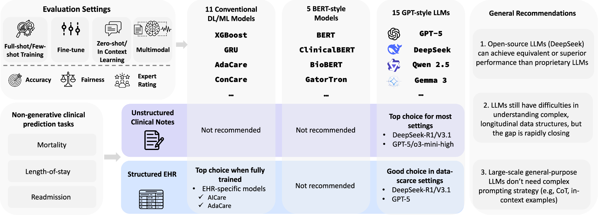

# ClinicRealm: Re-evaluating Large Language Models with Conventional Machine Learning for Non-Generative Clinical Prediction Tasks

[](https://arxiv.org/abs/2407.18525)
[](https://www.nature.com/articles/s41746-026-02539-z)

This repository contains the code and resources for our paper "ClinicRealm: Re-evaluating Large Language Models with Conventional Machine Learning for Non-Generative Clinical Prediction Tasks", which has been accepted by **npj Digital Medicine (2026)** and is available at [https://www.nature.com/articles/s41746-026-02539-z](https://www.nature.com/articles/s41746-026-02539-z).

- **Online Benchmark Results:** [https://yhzhu99.github.io/ehr-llm-benchmark/](https://yhzhu99.github.io/ehr-llm-benchmark/)
- **MIMIC-IV Preprocessing Code:** [https://github.com/PKU-AICare/mimic_preprocessor](https://github.com/PKU-AICare/mimic_preprocessor)
- **TJH Preprocessing Code:** [https://github.com/yhzhu99/pyehr](https://github.com/yhzhu99/pyehr)

## 📖 Overview

Large Language Models (LLMs) are increasingly deployed in medicine. However, their utility in non-generative clinical prediction, often presumed inferior to specialized models, remains under-evaluated. Our ClinicRealm study addresses this by benchmarking 15 GPT-style LLMs, 5 BERT-style models, and 11 conventional machine learning/deep learning methods on unstructured clinical notes and structured Electronic Health Records (EHR).



*Main overview figure from the published ClinicRealm paper in npj Digital Medicine.*

Key findings from our study include:
*   **Unstructured Clinical Notes:** Leading LLMs (e.g., DeepSeek-R1, DeepSeek-V3.1-Think, GPT-5) in zero-shot settings now decisively outperform finetuned BERT models for clinical note predictions.
*   **Structured EHR Data:** While specialized models excel with ample data, advanced LLMs (e.g., GPT-4o, GPT-5, DeepSeek-V3.1-Think) show potent zero-shot capabilities, often surpassing conventional models in data-scarce settings.
*   **Open-Source vs. Proprietary:** Leading open-source LLMs can match or exceed proprietary counterparts in these non-generative clinical prediction tasks.

These results establish modern LLMs as powerful tools for non-generative clinical prediction, particularly with unstructured text and offering data-efficient options for structured data, thus necessitating a re-evaluation of model selection strategies in predictive healthcare.

## 🎯 Prediction Tasks

The following prediction tasks, based on the MIMIC-IV and TJH datasets, have been implemented and evaluated in this repository as per our manuscript:

### [Structured EHR Data Tasks](src/structured_ehr/README.md)
(See `src/structured_ehr/README.md` for more details)
*   In-hospital Mortality Prediction
*   30-day Readmission Prediction
*   Length-of-Stay (LOS) Prediction

### [Unstructured Clinical Notes Tasks](src/unstructured_note/README.md)
(See `src/unstructured_note/README.md` for more details)
*   In-hospital Mortality Prediction
*   30-day Readmission Prediction
*(Note: The codebase in `src/unstructured_note/` also includes implementations for Medical Sentence Matching and ICD Code Clustering tasks, though they are not included in the manuscript.)*

## 🚀 Model Zoo

We examine a diverse array of models:

### Large Language Models (LLMs)
*   **General Purpose LLMs:**
    *   GPT-2
    *   GPT-4o
    *   Gemma-3
    *   Qwen2.5
    *   DeepSeek-V3
*   **Medically Finetuned LLMs:**
    *   BioGPT
    *   Meditron
    *   OpenBioLLM
    *   BioMistral
*   **Advanced Reasoning LLMs:**
    *   HuatuoGPT-o1-7B
    *   DeepSeek-R1 (7B, 671B)
    *   GPT o3-mini-high

### BERT-based Models
*   BERT
*   BioBERT
*   ClinicalBERT
*   GatorTron
*   Clinical-Longformer

### Conventional Clinical Predictive Models
*   **Conventional Machine Learning:**
    *   CatBoost
    *   Decision Tree (DT)
    *   Random Forest
    *   XGBoost
*   **Deep Learning:**
    *   GRU
    *   LSTM
    *   RNN
*   **Advanced Predictive Models for Longitudinal EHR:**
    *   AdaCare
    *   ConCare
    *   GRASP
    *   AICare

## 🗄️ Repository Structure

-   `src/structured_ehr/`: Contains all code related to experiments on structured EHR data.
-   `src/unstructured_note/`: Contains all code related to experiments on unstructured clinical notes.
-   `my_datasets/`: This directory is intended as a location to store preprocessed datasets.

## ⚙️ Requirements and Setup

This project uses Python 3.12. We use `uv` for Python package and environment management.

1.  **Install uv:**
    If you don't have `uv` installed, follow the official installation guide: [https://github.com/astral-sh/uv#installation](https://github.com/astral-sh/uv#installation)

2.  **Create virtual environment and install dependencies:**
    Navigate to the root directory of this repository and run:
    ```bash
    uv sync
    ```
    This will create a virtual environment and install all necessary packages specified in `pyproject.toml` and `uv.lock`.

## 💾 Data Preprocessing

This study utilizes two main datasets:
*   **TJH (Tongji Hospital COVID-19 dataset):** Publicly available structured EHR data.
*   **MIMIC-IV (Medical Information Mart for Intensive Care IV):** Includes structured EHR data and unstructured clinical notes.

For preprocessing the MIMIC-IV datasets (both structured EHR and clinical notes), we provide dedicated scripts in a separate repository:
➡️ [**PKU-AICare/mimic_preprocessor**](https://github.com/PKU-AICare/mimic_preprocessor)

Please follow the instructions in the `mimic_preprocessor` repository to prepare the MIMIC-IV data. The TJH dataset preprocessing follows the [COVID-19 EHR benchmark](https://github.com/yhzhu99/pyehr). Preprocessed data should ideally be placed in the `my_datasets/` directory or configured accordingly in the experiment scripts.

## 📝 Cite this Work

If you use ClinicRealm in your research, please cite the npj Digital Medicine article:

```bibtex
@article{zhu2026clinicrealm,
  title = {{ClinicRealm}: Re-evaluating large language models with conventional machine learning for non-generative clinical prediction tasks},
  author = {Zhu, Yinghao and Gao, Junyi and Wang, Zixiang and Liao, Weibin and Zheng, Xiaochen and Liang, Lifang and Bernabeu, Miguel O. and Wang, Yasha and Yu, Lequan and Pan, Chengwei and Harrison, Ewen M. and Ma, Liantao},
  journal = {npj Digital Medicine},
  volume = {9},
  number = {1},
  pages = {319},
  year = {2026},
  doi = {10.1038/s41746-026-02539-z},
  url = {https://www.nature.com/articles/s41746-026-02539-z},
}
```
